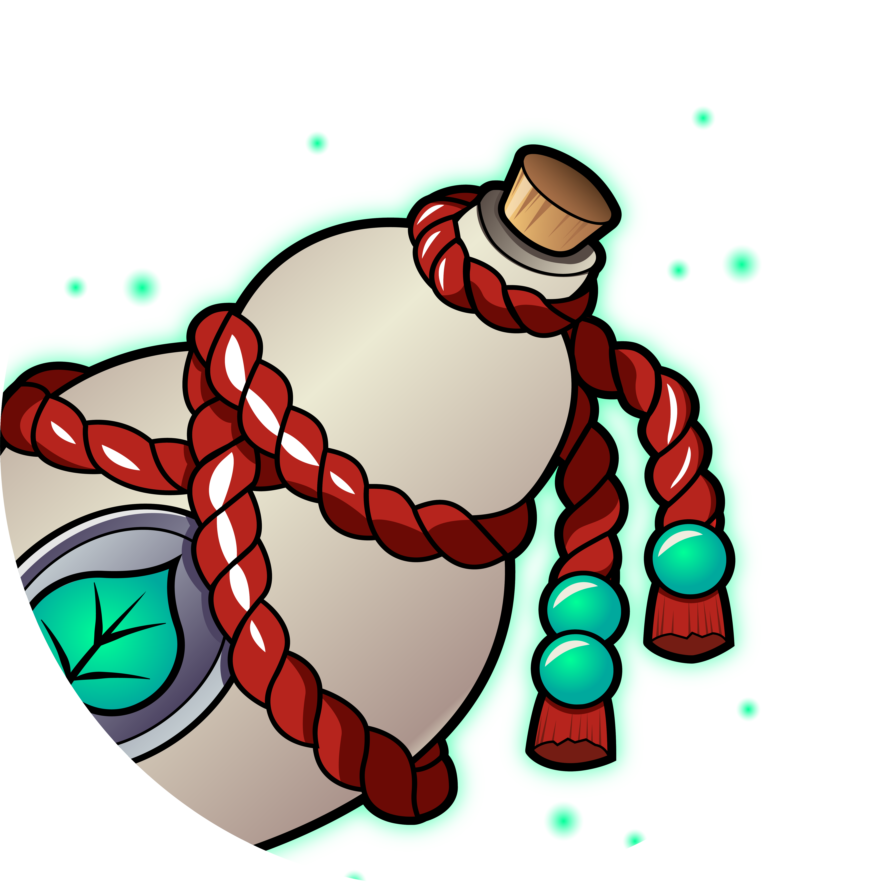

# 🏛️ TEMPLE FIVE DAWNS // ХРАМ ПЯТИ РАССВЕТОВ

  

  <em>Архив русскоязычного Discord-сообщества для игроков класса монах в World of Warcraft</em>

## 📜 О проекте

Данный репозиторий представляет собой полный архив ресурсов, стратегических документов и медиа-материалов русскоязычного Discord-сообщества **"Храм Пяти Рассветов"** — официального сообщества для ~15'000 игроков класса монах в игре [World of Warcraft](https://worldofwarcraft.blizzard.com/).

Автор репозитория являлся **co-HEAD** данного Discord-сообщества и принимал активное участие в его развитии и стратегическом планировании.

> Если вам, важны ключевое понимания и суть любых дискорд-сообществ, выстроенных вокруг единой персоналии или ;экс-~~инк~~-клюзивной группы привелегированных лиц, можете сразу переходить и заканчивать чтение с [консолидированного мнения](./messages/foundation/consolidated-statement.md).

> Личные мнения можно прочесть в [письмах](messages/foundation/letters/), они адресованы конкретным участникам сообщества, служат точкой понимания и восприятия внутренних процессов.

Программа развития базировалась на принципах:
- **Свобода самовыражения** vs излишняя цензура
- **Меритократия** vs персоналистичность
- **Прозрачность** vs закрытость административных процессов
- **Развитие** vs стагнация
- **Сообщество** vs культ личности

Документы в директории [`foundation/`](./messages/foundation/) представляют собой комплексную программу трансформации традиционного Discord-сервера в современное, демократичное и самоуправляемое сообщество. Программа включала:

- Внедрение системы голосования по развитию сообщества
- Создание публичной летописи достижений участников
- Реформу административной структуры
- Развитие уникального контента и внутренней культуры
- Стратегии роста и удержания аудитории
- Демократизация управления — введение прозрачности и сменяемости администрации
- Создание Community Council — площадка для участия сообщества в принятии решений
- Реформа модерации** — отказ от авторитарно-эмоционального стиля управления
- User Acquisition — стратегии привлечения новой аудитории
- Признание заслуг — система публичного признания вклада участников
- Уникальное торговое предложение — разработка отличительных особенностей сообщества

**К сожалению, данная программа модернизации так и не была реализована** в полном объёме из-за организационных и политических сложностей внутри сообщества.

  

## 🔗 Связанные ресурсы
- **Официальный Discord:** [Храм Пяти Рассветов](https://discord.gg/P52zeKR)
- **Официальный сайт:** [templefivedawns.ru](https://templefivedawns.ru/)
- **Тематика:** World of Warcraft — Класс Монах
- **Аудитория:** Русскоязычное игровое сообщество
- **Масштаб:** 15,000+ участников Discord-сервера

## 📚 Содержание

### 🖼️ Медиа-ресурсы ([`/images/`](./images/))
- **Арт и визуальные материалы** — концепт-арты, референсы, логотипы сообщества
- **Эмодзи-пак** — полная коллекция кастомных эмодзи для Discord (400+ уникальных эмодзи)
- **Стикеры** — коллекция анимированных стикеров для сообщества
- **Мемы** — архив мемов и развлекательного контента
- **Роли** — визуализация ролевой системы сообщества

### 💬 Сообщения и контент ([`/messages/`](./messages/))

#### 📋 Администрирование ([`/messages/administation/`](messages/administration/))
- [`adm-candidates.md`](messages/administration/adm-candidates.md) — Материалы для кандидатов в администрацию
- [`gm-candidates.md`](messages/administration/gm-candidates.md) — Материалы для кандидатов на роль Великий Мастер

#### 💭 Чат и принципы ([`/messages/chat/`](./messages/chat/))
- [`adm-tenets.md`](./messages/chat/adm-tenets.md) — Принципы администрации сообщества
- [`civil-tenets.md`](messages/chat/civil-tenets.md) — Основные принципы сообщества
- [`adm-tenets.json`](./messages/chat/adm-tenets.json) — JSON-версия принципов администрации
- [`mmxxiv.md`](./messages/chat/mmxxiv.md) — Обращение к сообществу

#### ℹ️ Информация ([`/messages/information/`](./messages/information/))
- [`welcome.md`](./messages/information/welcome.md) — Приветственное сообщение
- [`roles.md`](./messages/information/roles.md) — Описание ролей в сообществе
- [`atlas.md`](./messages/information/atlas.md) — Атлас сообществ монахов
- [`atlas-embed.md`](./messages/information/atlas-embed.md) — Встраиваемая версия атласа

#### 🔍 Discovery ([`/messages/discovery/`](./messages/discovery/))
- [`about.md`](./messages/discovery/about.md) — Информация о сообществе

#### 🏗️ Стратегические документы ([`/messages/foundation/`](./messages/foundation/))

Наиболее значимая часть репозитория содержит **масштабную программу модернизации Discord-сообщества**, разработанную автором, но так и не реализованную.

##### 📄 Основные документы
- [`consolidated-statement.md`](./messages/foundation/consolidated-statement.md) — Консолидированное мнение о проблемах и решениях
- [`strategy-roadmap.md`](./messages/foundation/strategy-roadmap.md) — Дорожная карта развития сообщества
- [`strategy-old.md`](./messages/foundation/strategy-old.md) — Старая версия стратегии
- [`strategy-precursor.md`](./messages/foundation/strategy-precursor.md) — Предшественник стратегии
- [`mmxxiv.md`](./messages/foundation/mmxxiv.md) — Новогоднее обращение к сообществу 2024
- [`personal-opinion.md`](./messages/foundation/personal-opinion.md) — Личное мнение автора
- [`library.md`](./messages/foundation/library.md) — Библиотека мнений
- [`draft.md`](./messages/foundation/draft.md) — Черновик документов

##### 🎯 Стратегия ([`/messages/foundation/strategy/`](./messages/foundation/strategy/))
- [`README.md`](./messages/foundation/strategy/README.md) — Индекс стратегических документов
- [`01-community-diagnosis.md`](./messages/foundation/strategy/01-community-diagnosis.md) — Диагностика проблем сообщества
- [`02-governance-transparency.md`](./messages/foundation/strategy/02-governance-transparency.md) — Прозрачность управления
- [`03-unique-value-proposition.md`](./messages/foundation/strategy/03-unique-value-proposition.md) — Уникальное торговое предложение
- [`04-user-acquisition-retention.md`](./messages/foundation/strategy/04-user-acquisition-retention.md) — Привлечение и удержание пользователей
- [`05-content-moderation-guidelines.md`](./messages/foundation/strategy/05-content-moderation-guidelines.md) — Руководство по модерации контента
- [`06-implementation-roadmap.md`](./messages/foundation/strategy/06-implementation-roadmap.md) — План реализации

##### 🔍 Проблематика ([`/messages/foundation/problematics/`](./messages/foundation/problematics/))
- [`challenges.md`](./messages/foundation/problematics/challenges.md) — Вызовы сообщества
- [`extinction-unanimous.md`](./messages/foundation/problematics/extinction-unanimous.md) — Проблема единогласия
- [`false-sence-of-comfort.md`](./messages/foundation/problematics/false-sence-of-comfort.md) — Ложное чувство комфорта
- [`kin-dza-dza.md`](./messages/foundation/problematics/kin-dza-dza.md) — Анализ по мотивам фильма "Кин-дза-дза"
- [`personal-regiment.md`](./messages/foundation/problematics/personal-regiment.md) — Личный режим
- [`persona-is-distress.md`](./messages/foundation/problematics/persona-is-distress.md) — Персона в бедствии
- [`rat-man-fractals.md`](./messages/foundation/problematics/rat-man-fractals.md) — Фракталы крысиного человека
- [`revert-undo.md`](./messages/foundation/problematics/revert-undo.md) — Проблема отката изменений
- [`rules-and-free-choce.md`](messages/foundation/problematics/rules-and-free-choice.md) — Правила и свободный выбор
- [`the-only-thing-they-fear.md`](./messages/foundation/problematics/the-only-thing-they-fear.md) — Единственное, чего они боятся
- [`wars-and-games.md`](./messages/foundation/problematics/wars-and-games.md) — Войны и игры
- [`you-can-not-do.md`](./messages/foundation/problematics/you-can-not-do.md) — То, что нельзя делать

##### 📝 Фрагменты ([`/messages/foundation/fragments/`](./messages/foundation/fragments/))
- [`README.md`](./messages/foundation/fragments/README.md) — Индекс фрагментов
- [`01-the-diagnosis.md`](./messages/foundation/fragments/01-the-diagnosis.md) — Диагноз
- [`02-the-vision.md`](./messages/foundation/fragments/02-the-vision.md) — Видение
- [`03-the-governance.md`](./messages/foundation/fragments/03-the-governance.md) — Управление
- [`04-the-recognition.md`](./messages/foundation/fragments/04-the-recognition.md) — Признание
- [`05-the-strategy.md`](./messages/foundation/fragments/05-the-strategy.md) — Стратегия
- [`06-the-moderation.md`](./messages/foundation/fragments/06-the-moderation.md) — Модерация
- [`07-the-apology.md`](./messages/foundation/fragments/07-the-apology.md) — Извинение

##### 👥 Персональные обращения
- [`resignation-letter.md`](messages/foundation/letters/resignation-letter.md) — Письмо об отставке
- **Kerrigan**
  - [`andrey.md`](messages/foundation/letters/andrey.md) — Андрей
- **Janesina**
  - [`janesina.md`](messages/foundation/letters/janesina.md) — Женя
- **Nims**
  - [`nims.md`](messages/foundation/letters/nims.md) — Павел
- **Janisse**
  - [`janisse.md`](messages/foundation/letters/janisse.md) — Юля

## 🛠️ Техническая информация

- **Формат:** Markdown документы, изображения PNG/JPEG/GIF
- **Структура:** Модульная организация по типам контента
- **Эмодзи:** Готовые к импорту в Discord (формат PNG, оптимизированные размеры)
- **Локализация:** Полностью русскоязычный контент

## 📚 Как использовать

Репозиторий может служить:
- **Шаблоном** для создания игровых Discord-сообществ
- **Кейс-стади** по развитию онлайн-сообществ
- **Архивом** методологий управления игровыми сообществами
- **Источником** готовых ресурсов (эмодзи, стикеры, структуры)

## 📄 Лицензия

Данный архив представлен в образовательных и исследовательских целях как документирование опыта развития игровых онлайн-сообществ.

---

  <em>"The future belongs to those who change it."</em> 
  — Neo Monk Discord Community

