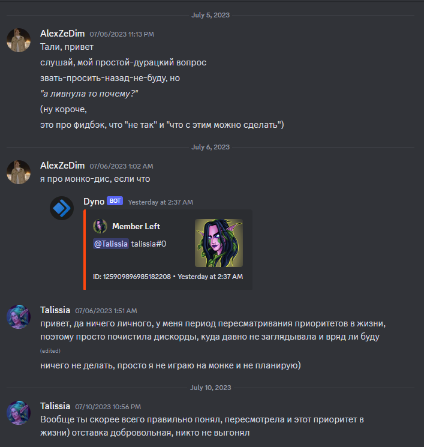

# Dear Andrey

Привет, Андрюш. 

Личное-к-личное. Сообщество-к-сообществу.

Мне почти 30. Я так устал от этих мышиных войн. Я все эти игры уже прошел, годы назад. Я так устал.. [Смертеееельно устаааал](https://www.youtube.com/watch?v=t4MU61xh_ZI). Просто заебався. Ты-б знал как. Я с самого момента, нашего знакомства сказал, что войну за твой ум и сердце, я даж не собираюсь... 

Ну и ты ж сам не глупый и понял давно, что я здесь как любой оппортунист, в системе которую я хорошо знаю, приватизировал общественное мнение, подталкивая мир туда, куда он и так придет. Со мной или без меня.

Ну и ты вроде понимаешь, что, я так-же, как и все, очень устал. Очень. Просто бляяяя. Ну вот на риторику даж мою посмотри. Я прост уже не могу серьезный ебальник держать.

- Захожу в #правление. А там какая-то ~~страх~~ незрелость и ~~ненависть~~ несерьезность. Ну бля. Дохуя эго и персонализма. Какой-то страх и безответственность за последствия принятых решений. Все эти, 'нет, надо замышиться, а то начнется срач'. Какой-то, незрелый пиздец прям. Ну правд. Никто ни хуя делать, или не хочет, или может. Ну или может.... но почему тогда не делает, да? Ну ок.

- Потом идёшь такой в публичное поле, а там стремление к социальному одобрению и комфорту вплоть, до требований, от одних. И стремление продемонстрировать гипер-лояльность и раздражение в виде пассивного-безразличия на этот факт от других. И это не только про нас, если что.

> *Ребят, ну что хуйня, а? Вы зачем все это в ярмарку-тщеславия своего эго превращаете? Ну ладно, я конешн тож не идеален там после Кристины, попостил дерьа. Но чо вы хочете, никто ж не пишет, смотри я обосрался! Пожалуйста, только лайки. Только нежно ко мне! Я очень ранимый. Короче, скука и никакой (само)иронии.*

Обсуждения, мнения, поиск баланса, это круто. Ничё не имею против. Серьезно. Это ж пиздец как смело. Вытаскивать языки из задниц. Это реально то, что нам всем надо.

 - У палача должна быть маска на голове! Я так сказал!
 - Да не должна, блять. Иначе, не получится построить сообщество на взаимоуважении, в котором персона боится взять ответственность за принятое решение.

Но, правда в том, что обсуждения должны быть не только в #правлении.

~~Социум~~, ~~сообщество~~, чат уже давным-давно устал от установок и персоналий. Ему не нужна ни ещё одна я-такая-не-такая ОХУЕННАЯ персоналия, ни ещё один админ. 

Особенно, если этот чел, будь он админ или под-протекцией, всячески демонстрирует это своей риторикой, ролями, да чем угодно. Устали люди от такой хуйни. Устаааааали.

Ладно ещё, я. Тот ещё шут. Свита играет короля. Но бляяя.

Чату вообще не нужен никто, кроме друг-друга и условий. Да и здесь тоже, мешают предвзятость, неспособность менять мнения, заборы в головах, и непроговоренные комплексы. Потому что нет общего пространства, где есть 'место для срача', где люди могли бы свободно высказывать мнения друг-о-друге. А 'стабильность', закольцовывает, просто усугубляя это всё.

Ты же вон, нормальный парень. Сам прекрасно формулируешь, когда мотивация есть.
1. Да не мне одному скучно. Ну посмотри вокруг сам, застой и несменяемость. Прикинь, ты б на первое апреля со всех, включая себя, роли снял и все побыли-бы монахами. Ну или наоборот. Хуй знает.
2. Да и со срачами-скандалами-интригами. Просто ты не так слова подобрал. Но вот с мемами прям отлично в суть попал. Бля, ну никто не виноват в том, что потом, кто-то на кого-то обижается, и это выливается в скандалы-интриги-расследования ПАТАМУШТА МИНЯ ОБИДЕЛИ. Все мы вокруг, люди, што-поделать.

> *По поводу мемов, вот моей первой реакцией был смех. На самом деле, мне очень нравится самоирония. Я когда фильмы смотрю, бывает сам такой, ХАХА о-о-о смотри это-ж я! Второй мем конечно, ну-такооое, не совсем качественный. Я бы сказал. Ты то наверное хотел задеть этим, и задел. Может конечно не то, что хотел. Но спасибо. Суть-то верная. Именно этого и не хватает. Это над в чат было кидать и писать, тип-ну-бля-типичный-Саня-хуле. Ну не могу же я обижаться на себя. На правду. Так и есть, вот посмотри я пишу много. Так получается. Люди не всегда понимают почему. И не всегда желают понимать. Вот может даже ты думаешь, что я снисходительно поучаю. А я на самом деле, делюсь. Делюсь мнением. Это даже не комментарий, учитывая что я потом делаю. Я вообще почти всё делаю ради себя, просто таким образом я объясняю сам-себе что я делаю.*

А чат в основном одного хочет, — потехи. Посмеяться. Иногда друг на другом. Ну и что бы от них отъебались с ЖЕСТЬЮ:)

А пока клоунов нет, клоуны, — это все эти [ЦАРЬ-ВО-ДВОРЦА-Я-ВАЖНЫй-КУРИЦ](https://www.youtube.com/watch?v=ff7nJZvaeOg) *ну если читал про персоналистические сообщества, сам догадаешься.* https://discord.com/channels/217529277489479681/1202004425267486770

Йош кстати, эту мысль выкупил прям на соточку. :100: % Он и придумал тихо сидеть, сняв с себя все роли, без этих корон на голове. Пока за него всё делала Талиссия с Мерком, как раз ради этой короны, без понимания. Потом я правда Вишне проговорился с этим. Ну а Вишня... и так понятно. Отсюда, видимо, она эти скобочки после каждый фразы и ебашила. Это пожалуй единственное, что имеет смысл оттуда копировать.

Конечно, если ты хочешь, построить из сообщества, вокруг себя, дискорд-друзьяшек. Побегать по дискордикам за девочками. Или поиграть роль, ну там [вето-игрока](https://bigenc.ru/c/veto-igrok-dced05). Да пожалуйста. Так и скажи. Для кого-то и это тоже зрелище.

Но выражаясь все же жениным, а не твоим языком: *я скажу абсолютно-точно-не-будет: тут я тип топаю ножкой*

Эксклюзивно для тебя или *твоих* друзьяшек-подружек, никто решать кризисы и создавать персональный комфорт с удобствами не будет. Ну а если кто-то и подпишется под этим, [то на каких-условиях это будет, на самом деле, позже сам узнаешь...](https://www.youtube.com/watch?v=Z-7j2YKig_I).

> *Думаю ты уже заметил, я использую историю сообщений по назначению. Сравниваю, прошлое с настоящим, как любая персона меняется. Слежу за употребляемой риторикой и прочее. Я знаю что ты нормальный, вон с Юлей умел договариваться. Я вот вообще без-эмоций-на-этот счет. У меня же есть рациональное объяснение тому что и как происходит. Из какой причины, какое следствие, вот и очередной кризис.*

Андрей, единственный человек которому это может быть интересно, это ты сам. В сообществах давно уже все эт просекли из тех, кто вообще способен хоть что-то поделать, помимо перевода гайдов. Даже Юля. Просто ей нравится... *что-ей-там-нравится*. ~~хозяйствовать, быть барыней и челядь-сапогом- в пузо пиздить?~~ Ну так, она прикольная девчонка, кста. Уважаю её за прямоту и всё это.

В контексте прошлого, Юле повезло. Пиздец как повезло. Но мы нихуя не можем вернуться в прошлое. Зачем-то иногда переживаем его. Нахуя? Непонятн.

Вызовы, с которыми сталкивалось сообщество при ней, несмотря на её историю и нынешнюю репутацию, были не столько социальные, сколько про развитие. Про игру, про контент, про строительство. Аудитория прибывала, вокруг движуха. С нуля всегда строить проще.

Выражаясь Юлиным языком (https://discord.com/channels/217529277489479681/323531345961811968/885581252021862401).

Для Юли, проблема это когда люди в спековых каналах не отвечают. Для меня, проблема, не если чат пустой. А причина, по которой чат, — пустой. Времена меняются, Юляша, видимо и канал-помойка нужен.

Но реальный вопрос, который стоит, вообще в другой плоскости. В той, как и по какой дороге в будущее пойдет сообщество. Ты ж не мессия-Иисус, что бы выбирать между сообществом-людей или собой. Ты человек и выбираешь себя. Или Женю. Короче любовь к... кто-там-для-тебя важен. С этим всё ок. С тобой всё ок.

но вопрос в том:

- Упадет ли дальше и большее в персонализм 'сейчас я скажу как будет'`*`, как это было в прошлом и с соседними сообществами? Повторится ли подобная история?
`* - да вроде как это такая маска-игра-ролевая-модель, но бля... это-ж ролевая модель, да? Тип меня передразнить? Тип это несерьезно всё?`
- Или оно изменится, станет более активным и коллективным? Сообществом, в котором участники все же нужны сообществу. Не для пассивным реакций, а ради друг для друга?

Сам же видишь, сейчас, сообщество ужимается. И вызовы, которые будут стоять перед сообществом, — социальные. Ну ты посмотри. Игра в упадке, она давно уже не на первом месте. Все кто сидят в чатах, по большей части не играют в игру. У всех предрассудки и заборы-в-головах, и они будут расти и дальше, если парадигма не поменяется. А разгребать чужое легаси, — мало приятного. Поэтому с новичками всегда проще. У них нет установок на этот счет. Вот им и нужны правила. Я это и учитывал в своей стратегии с отниманием чужого пирога из других дискордов, офф-форума и дейтингов. А если нет экспансии и не планируется - правила вообще можно удалять, они и так у всех в головах застряли. Их отсутствие даж не заметят.

Короче, если сообществом 'не заняться', застой так и продолжится, дальше по инерции.

В технологиях, конечно можно найти ответ на многие социальные вызовы. Инструменты публичных-анонимных и социальных опросов. Голосования. Потешный вопрос. Нет ничего невозможного, при достаточном количестве времени.

Сообществам, кстати не нужен хозяин. Максимум, лидер, да и то, каждый хочет им быть. Сменяемый лидер. Ну или команда. Никто бы не крутил логи на warcraftlogs, если бы у кого-то одного была несменяемая [доминантная стратегия](https://ru.wikipedia.org/wiki/Доминирование_(теория_игр)).

Но если то, чё ты хочешь у тебя уже-есть. Ну тогда зачем что-то менять?

Если Женя твоя подруга и советник, то не надо это 'мышить', так и скажи. Люди это и так видят, у людей есть вопросы, и пока они их замалчивают и не получают ответов, непроработанные темы их раздражают.

# ОТ ДУШИ

Конечно хотелось бы выборного, преемника. Но потом поговорил с тобой, и понял что мой преемник, на самом деле это ты, Андрей. Что-ж, может не выборность, так сменяемость. Уже пол-дела. 

В конце концов, даже если бы кто-то единолично и разрулил всё это. То это будет как-то не правильно. Будет как с Юлей. Юля есть, а тебя — нет. А со мной, так вообще какой-нибудь блядский [The Vice](https://www.youtube.com/watch?v=hwqvplvAyUM). Потом ещё чё-то не поделим... Да нахуй оно нам надо, а?

Короче, параллель между нами есть. Ты по возрасту, плюс/минус там-же, где и я был в начале своей истории. https://discord.com/channels/217529277489479681/1202651789019717642/1202651993244704779

У нас с Кисой, Андрюш, вот если читать будешь, я те так скажу. https://discord.com/channels/217529277489479681/1202651789019717642 У нас с Кисой, лучшая школа самодурства, автократии и персонализма в игре была. Не хуже, чем работка в админке у вашего картофельного или нашего фюррера. Мож даже покруче. Что ты думаешь, я так много пишу. Просто следствие из пережитого.

А так, в твоё личное, не хочу лезть. Ты сам с ним разберешься.

Дискорд-сообщества, игра для молодых. Это твоя игра. Моя вон, уже давно пройдена и закончена. Хочу закрыть дискорд и спрятаться в домике.

Одну скажу, не веди себя так, словно ты обиженная, самовлюбленная-девочка, которая сидит в дорогой эхо клетке-комнате, с короной на голове и [ведет так, словно ей все должны](https://www.youtube.com/watch?v=44b_vKrLrGQ). Объективно говоря, — [ты ж ею не являешься](https://www.youtube.com/watch?v=JFeaWHDQzQA).

А я устал. [Смертеееельно устаааал](https://www.youtube.com/watch?v=t4MU61xh_ZI). Просто заебався. Ты-б знал как.

Мне почти 30. Я так устал от этих мышиных войн. Я все эти игры уже прошел, годы назад. Классовые-сообщества, — это игра для молодых. А я хотю, со своей девочкой, смотреть фильмы, гулять там и готовить запечённое филе из мурманской трески под топпингом из оливок и томатов черри со сливочным картофелем гратен с базиликом и сырной корочкой. Бля, еле вписал. Они эт сёрьзн? Как это готовить? 

Короч пока что мне нужно время и разрулить свои кризисы. Мне в жизни такой возни, прям-по-горло-в-говне. Решу, а потом.... Ну а потом мож будет время попилить чот прикольное.

Соре, если где-т там налажал. Но в целом, за всё время, я поделился с этим сообществом чем смог. Библиотеку и мысли оставляю в наследство. Мож не оч интересно читать, но захочешь - прочтешь потом. Ну или удалишь. Сам решай. 

Уходить конечно никуда не собираюсь. Буду сидеть тут же в дискорде, просто пока неактивничать. Мож попукивать чот в чатик, но так. Любя. Допускаю что мб быть как-нить вернусь и буду ещё творить чо-нить. Но пока у меня нет сил даже на Я ВАС НИНАВИЖУ БЛЯДЬ!  

Я был самым счастливым человеком, пока не открывал дискорд весь этот январь. Хочу так-же ещё 11 раз.

Всё. Я вспомнил что я человек. ХАчу демарш. Топать ножкой и показать что у меня есть эмоции. И вообще я там обиделся. Да.

Ребят, надеюсь, найдешь чем успокоить. Если ебанёшь какой-нить анонс, я подыграю. От почётной отставки до изгнания с позором.

Все. Уф, у нас здесь ни парламент, ни дом правительства, не админка. Заебали все эти серьёзные ебальники из классовых и их чсв-официоз. На нахуй. Фу.

Без всякой гордой хуйни, если что, я никуда не ливаю, если чо среди монахов, тут неподалеку...

Но бля, не дергай в ближайшее время. Не над. Мы вообще не френды и ты-б знал как же я ко всему этому с тихой ненавистью. Я конечно верю во всё что пишу. В сменямость. В выборность. В идеалы. Но эта социалка пиздец истощает. Хочу опять на Бали, как меня все заебали.

Уверен все придумаешь, и решишь что-то.

Короче сам разберешься.

|| ПОМОГИ || || СЕБЕ || || САМ ||

<3 от души

