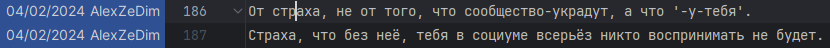

мне прям теперь любопытно чем закончился 
у меня ток что был диалог в закрытом канале с андреем
так что, го аттракцион, как со вчерашними мессагами, тип 'а это не Юля'

Что-бы построить независимое и автономное сообщество.
Что бы 'тащить' Храм Пяти Рассветов, нужны:
 - опыт
 - команда
 - желание
 - ресурсы

Андрею интереснее по чужим дискордам бегать, с друзьяшками общаться и ну и #женя.

Я его всем этим фактом настолько задел, что он этот перфоманс устроил, и отвечает мне в закрытом канале с тагами.

Ну а гордость, что бы 'сдать назад' и признать то, о чем я писал, видимо не позволяет

но и ownership отдать, ты верно заметил, для него...

причина тож простая, я не сразу это понял точно, но теперь вроде прям открылась дверь

короче, он или повзрослеет и свои проблемы решит
или так и будет дальше сидеть и ничего не делать
или будет сейчас торговаться

да ещё кольнул так.

как с вчерашними мессагами, чисто предикт машина:

