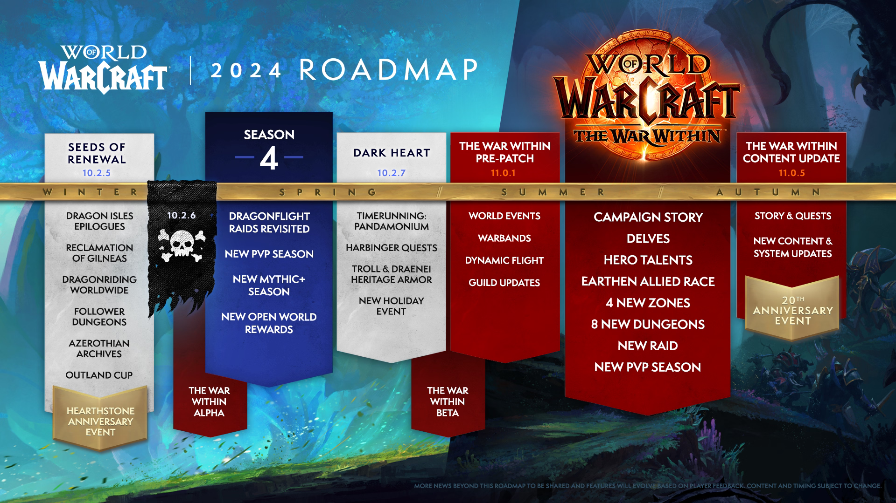

# NEO MONK DISCORD COMMUNITY
## STRATEGY ROADMAP

> *The future belongs to those who change it.*

1. Я не поучаю, я делюсь. Хотите — берите, хотите нет.
2. Это мой план. Моё виденье. Моя стратегия. Но, лучше оцените всё сами и сделайте по-своему.
3. Мой формат, мои правила. А они такие: тезис — что — возможность.

## Выполнить оценку

Определить спектр, приоритет и актуальность вызовов.
Определиться между персоналистичностью и сообществом.

### Возможность: 

Определиться с тем, что важно. С тем, какую политику с сообществом и чатом стоит проводить. С тем, какие условия необходимо создавать.

Лично, я не считаю единолично или высоко-персоналистические сообщества успешным или здоровыми сообществами. А в контексте классовых сообществ, — особенно. Тем не менее, цитируя я, именно их. Потому что они хороший пример для того, что бы не повторять их ошибки.

Самые активно-успешные чаты, все же у магов и разбойников. Там тоже хватает своего бардака и оппортунизма, но... в каком-то смысле, они нашли способ в своих триумвиратах не утонуть в тотальном персонализме.

Собственно, именно поэтому, я например (не) согласен с Вастриком в том, что секрет успеха в 'модерации'. Нет. Успех все-же не в модерации.

Ну или в ней, если это работа с аудиторией.

Просто модерация один из ключевых её рутинно-операционных аспектов. Когда есть что модерировать, конечно. Но прежде всего это много. Очень много, работы с аудиторией. Привлечение социальных групп из-вне, аналитика, выявление социальных паттернов, генерация и мониторинг инфо-поводов, общее развитие...

Мой взгляд, создавать условия, лучше. Точно лучше, чем тупо следить за исполнением кодекса правил и переводить гайды.

## Прозрачность и развитие.

Сообщество должно явно понимать и видеть куда оно идет и хочет прийти. А так-же возможность влиять на этот курс.

### Возможность

Все ливают из-за everyone-ов, они всех заебывают. Но, есть много участников сообщества, которые хотели бы быть услышаны.

~~Давай-те откроем админку~~ Ебаните какой-нибудь privilege-форум. C возможность голосования за посты. Там как раз есть функционал-аппрува через emojies.

Необходимо, что-бы администрация показывала таким образом, что она делает или хочет сделать. Тем самым, каждый мог увидеть, прочесть, и может даже поставить свой лайк.
Сперва никто нихуя не будет понимать и все такие чо-за-хуйня, но если админы на забьют и сами реально будут подавать свой пример, то сообщество потом, потенциально, сможет загореться этой идеей.
И таким образом, у людей будет возможность эти самые предложения вносить, тип: 'бля хочу запилить стикер, или эмодзи, вот конкретно этот'. Значит бахнуть темку на форуме. Если пугает возможность внесения слишком дохуя предложений от монахов, возможно стоит создать отдельную роль, вроде: функциональную-белую-роль-Советника. Специально для тех, кто хочет или заинтересован вносить, или модерировать предложения. Может тогда не монахи не смогу это делать, но хотя-б монахи могли видеть и читать.

Даже в Blizzard на последнем издыхании, как и ССР c EvE-ой, ебанули свой [community council](https://worldofwarcraft.blizzard.com/en-us/news/23743182/introducing-the-world-of-warcraft-community-council).
Они там конечно его не особо слушают, но суть жеста была в том, что тип: *мы-вас-слышим*, потому-что feedback каналов для связи уже прост не осталось, и Blizzard сами заметили, как они окуклились внутри, со своим я-всё-знаю-я-так-вижу.

> *Бежать и возвращать Юлю назад, вообще не вариант. Почему? Дело даже не в том, она 'ждет этого', а в том, что она знает. И возвращается не только ради гайдов-на-освоении и желания 'быть замеченной' Ей самой, оч важно, посмотреть и похихикать, как 'здесь всё ниоч без неё'. В какой-то момент она поняла, что стала сердцем сообщество, и поэтому - (самое)освободилась от этой роли и ушла. Сообщество там, где она. Её царство, у неё в голове. А не там, где написано, Храм Пяти Рассветов.*

> *Тем не менее её исторический вклад должен быть признаваемым, а мнение касаемо развития, иметь возможность быть услышанным. Другое дело, что Юля его расскажешь, если захочет сама. А хочет она, тогда и только тогда, когда видит что её признают и готовы её слушать.*

## Управленческая команда.

- Образ и престиж администрации. Убрать цвет ролей с административной-иерархии и следить за своей риторикой.
- Провести ревью ролей. Прозрачность назначений и сменяемость.

### Возможность

~~Прекратите быть 'клоунами'. Блядский. Пурпурный. Цвет. С административной роли.~~
~~Да снимите и выкиньте уже эти, ебанные, короны, из своих и чужих голов. Сообществу это, пиздец как дорого обходится.~~

Андрюш, вот лично к тебе, с уважением к тебе. И очень нежно.
Будьте поближе к людям. Сделай с этим что-нибудь.

[Не-надо-так](https://www.youtube.com/watch?v=y9FgQ8u2_Fk).
https://discord.com/channels/217529277489479681/217532087001939969/1200392585995374602
Не потому что, я или какой-то хуй с горы сказал.
Не потому-что ты там прав, а Лиат толкает какую-то конспирологическую хуйню. Я бы сам, тоже хотел поспорить, и втянуться, правда. 
Не потому-что у тебя не может быть своего мнения. Совсем нет.
А потому-что, да это пугает людей. И открытый опрос этого вообще не покажет. Даже закрытый это не покажет.
Но, ты же заметил, что даже такие незаметные изменения, степень уверенности, изменения в риторике и белая роль, может быть очень чутким сигналом для всех.
Сообщество чуткое, оно слышит и чувствует.

Просто, у тех, кто снаружи нашего сообщества, как в истории с Бадито. 
У участников внутри, тоже все ещё есть комплексы и коннотации на роль-и-цвет Модератора.
В их головах, пизданёт их теперь не Юля, а кто-то другой. Поэтому нужны изменения.
https://i.imgur.com/L94CY3Z.png

Пока-что, люди видят что на место одних 'неприкасаемых' просто пришли другие неприкасаемые. Причем, в лучших традициях, пришли через очень непрозрачные процедуры. Я здесь про себя, если-кто-не-понял.

Сменяемость и прозрачность, о которой я постоянно кричу, не нужна команде. Но она очень нужна сообществу. Хотя-бы видимость. 
Потому что непрозрачность и несменяемость, ой-я-где-то-уже-видел-эту-хуйню. Как олицетворение законсервированности и застоя.
Пора бы уже прекратить катиться по инерции и наверное что-то сделать с царями-в-головах у самих-себя и людей, иначе... будет иначе.

Должна быть управленческая команда и какой-то объединенный стол для принятия коллективных решений. Пока нет стола. Нельзя взамен предложить и место за ним.
А пока администрация воспринимается как потеха, никто гордый, не захочет быть частью потешного стола. Возможно оно и к лучшему, конечно? Если человек не умеет в само-иронию.

Йош придумал скрыть свой положение. Талиссия 'догадалась' и ушла. Миша-Рейнон, создал второй аккаунт, с которого он пишет-отвечает.

А включить всё назад, наводить страх и отпиздить вы сможете всегда. Вы-ж-здесь-власть. Но вообще лучше не включать. Взаимное уважение, м?

### Возможность

Как я уже сказал, это может не надо вам, но это надо сообществу. Хотя-бы видимость.

Сделайте уже описания ролей, способы их получения. Что-бы их было прям видно-видно. 
Пару видимых назначений и самое главное, отставок, с анонсами.
Открытые клаймы для ролей. Оставьте цвета только у игровой иерархии. 
Результативным игрокам очень надо быть [pimp-guy](https://www.youtube.com/watch?v=UDApZhXTpH8).
Они это любят. Они гордые. Не закольцовывайте инструменты признания, только на себе.

https://discord.com/channels/217529277489479681/968581699954946058

## Признание общественных заслуг.

В жизни сообщества, уйти от эксклюзивной-ролевой, модели признания. Это социальный тупик. Роли, это прежде всего полномочия, а не самоцель. 

### Возможность

Сообщество очень богато историей. Стоит уже наконец-то начать публично признавать вклад от ярких-персоналий в развитие сообщества.

В деталях: 

Создать какой-нибудь RO канал или RO форум-с-карточками, где общественным веб-хуком Храм Пяти Рассветов начать отражать объективный вклад активных участников или коллективные действия и яркие события в жизни сообщества.

 - Фейсмик был модером, заебись играл на монке, пушил ключи на р1, ходил на MDI, и его звали на интервью с Рейноном? - Секс, напишем об этом.
 - Юля заложила основы сообщества? Написала дохуя гайд-лайнов, мать-храма-пяти-рассветов и вообще участвовала в войне дискордов? - Охуенно, го и ей ебанём памятник. Юляше-я-б прям сам бахнул. Я ей нихуя не друг, но тем не менее, объективно уважаю. Только без жести. Нежненько. Она девочка. Она хозяйка. Строгая, но все-же. Не диктатор-Пиночет. For the greater good.

Только без сарказма и издевок. А с положительной коннотацией. Нежнее, пожалуйста. Людям пиздец как нравятся отражение их публичных достижений. Викинги со [своими мемориальными стеллами](https://ru.wikipedia.org/wiki/Варяжские_рунические_камни) были пиздец мудрыми, раз достижения в играх теперь вокруг и всюду.

Короче, чот тип летописи. Ну и так, что бы люди не ставили памятники самим себе, конечно. Одобрение текстовки через [кросс-ревью](https://ru.wikipedia.org/wiki/Рецензирование). Конечно, сперва идея будет спорной и не всем нравится текстовка и что у кого-то есть-а-у-кого-то нет. Но на старте, главное, что-б было чему бурлить.

## Персональный контент

Нужны правила модерирования и размещения для персонального контента.

### Возможность

Моя идея с отдельным каналом для контента сообщества https://discord.com/channels/217529277489479681/1164648692276539462, объективно говоря, — неудачное дерьмо. Такое-же дерьмо, как видеть посты, ссылкой на youtube от тех, кто зашел 5 минут назад.

Со всем этим надо что-то делать.

Нужен или хороший FAQ-гайд-лайн для новичков, с ссылками в welcome-посте или ещё один RO форум-доска для само-рекламы.

## УТП

Добавить уникальное торговое предложение для участников сообщества.

### Возможность

Так-же как гайды и сообщество для монахов можно найти только в Храм Пяти Рассветов. Нужно всё-таки что-то ещё, что бы сообщество понимало что ему нужны его собственные участники. Что они нужны друг другу. И для чего они ему нужны.

- например, дать общей игровой аудитории какие-то эксклюзивные условия и возможности в нашем сообществе.
- ну или самим создавать уникальные резонансные инфо-поводы и контент для обсуждения
- может быть, бросать вызовы или наоборот, коллабы с сопряженными игровыми сообществе, как тот-же кросс-чат

*Как например нейро-гороскоп у Родриги, он хорош тем, что первично-уникален и охватывает все когорты аудитории.*

У нас это был персональный и уникальный Пепа, где-то, это возможность выражать мнение свободно, то о чём 'люди-шепчутся-в-личках', где-то возможность повлиять на политику сообщества путем голосования и т.д. 

Если мы когда-то смогли прилечь внимание Гумбыча, раз он пришел, без тэга, значит ему было интересно. Вопрос в том, почему? И почему интересно именно ему?
Насколько он осознает и воспринимает феномен конкуренции за аудиторию?

Но нужно что-то уникальное. Сообществу не будет интересно, если постить очередных котиков, во имя лайков-комфорта-и-друзьяшек. Это уже делает ~~жена Амани~~ Оренжа, в дискорде шаманов. И например, нет смысла копировать правила от друидов, потому что просто не получится сформировать дискордик-с-псевдо-солидарными-мнениями на тему типо-высокой-ирл-политики, где облизывают админов. Это уже происходит у друидов.

Если и стоит что-то заимствовать и копировать, то не слепо.

И быть готовыми к тому, что потом, той же самой стратегией могут ткнуть и вас.

Сообществу нужна мотивация. Люди ведь сами должны пожелать написать что-нибудь. В других чатах они это делать не стесняются.

Моё УТП было простым.

Не буду скрывать. [Да, действительно.](https://www.youtube.com/watch?v=az04uStDQSM) Когда давным-давно нужен был инструмент для ~~скандалов-интриг~~-расследований. И мы его создали. Года ~3 назад.

Но я не ставил на это. Моя идея была про потеху, про забаву для всех. Пожалуй только Нимс, видел и знает детали.
Я поверил что сообщество сможет стать лучше. Преодолеть все эти вызовы и понаставленные границы.
Но, как оказалось теперь, у меня уже не так много времени, для всего этого.

Короче, каждому приходится придумывать что-то своё.

## User Acquisition

Работать с внешней аудиторией.

### Возможность

Конечно сложно привлечь новую аудиторию в игровое сообщества, потому что не появляются новые игроки, из-за политики подписки.

А нынешняя аудитория одна на все классовые сообщества, и она уже сделала свой выбор. Не получится скопировать чужие стратегии потому что у нас одни уже себя изжили, а другие эффективно работают у соседей-конкурентов, а не у нас. Но способы всегда есть:

Иногда можно просто 'раздразнить' её.
А можно и отправиться в игру, и работать с ней там, через зазывал за золотой-бюджет или адресо, с самым топом игроков на warcraftlogs.
Переманивать участников из других сообществ, каким-то эксклюзивными мемами про дс-монков?
Создать тему на офф-форуме, рядом с той блядской, и раскручивать её под эгидой того, что 'мы изменились'. Тем самым, откусывать аудиторию оттуда?
Индивидуально бегать и договариваться с профильными warcraft на низком старте? Мы вас даем доступ к аудитории, а вы взамен... Миша-Рейнон кстати пробовал что-то такое. А Амани тащит стриминг на себе сам.

Кто знает, у каждого здесь свой путь.
