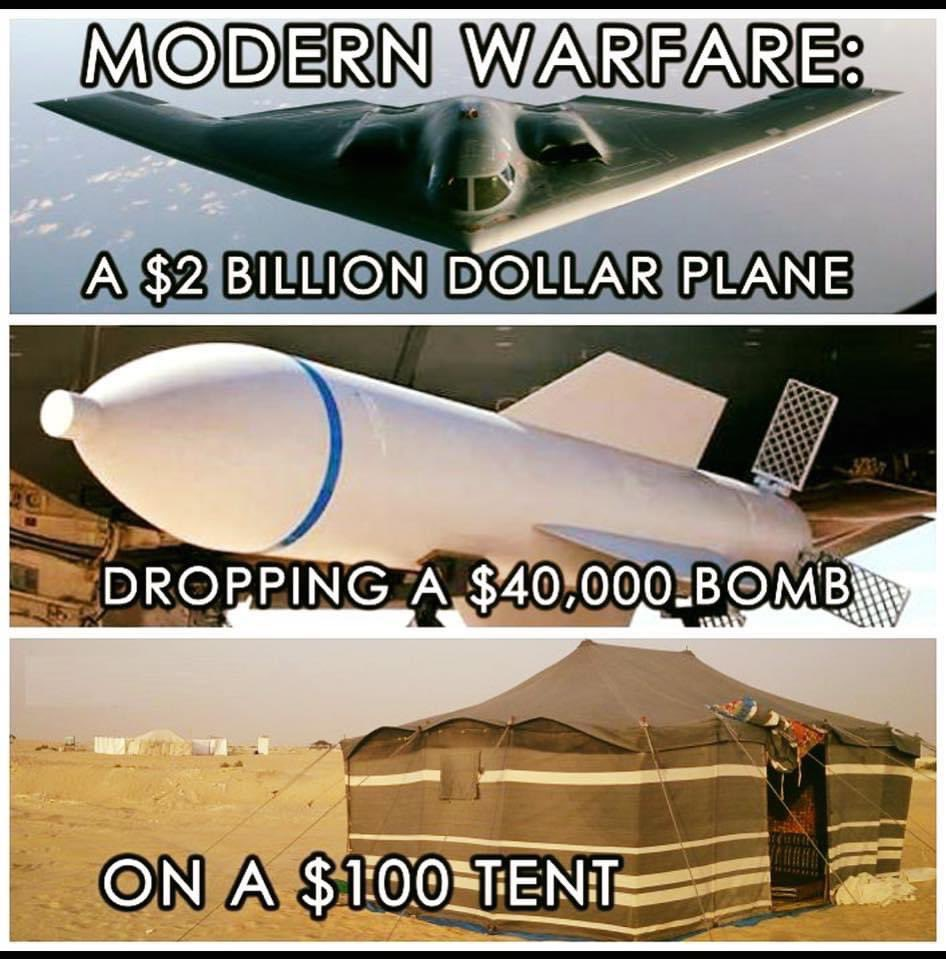
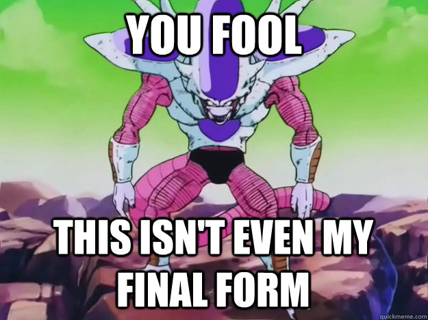
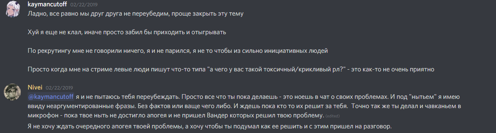

Пишу это для себя, Наркисы, Нимса и мож кого ещё потом добавлю.

Владу я вообще, обещал ответ когда-то. Где-то там, у меня есть долгая длинная и более художественная версия обсасывания всего этого, под названием *By-The-Game*, И растянутая на 4 года повествования. Такой-же клубок из хитросплетений социальных кризисов и персональных историй.

Серьезно, даже названия тогда придумал для глав, в хронологическом порядке:

- Succession
- Guild Wars
- Twilight of the Empire
- Last Survivor
- Questionable Loyalty
- Nobody but us

# Короче

Го твиттер-тред ебанём, типо 'здесь-был-я'. За знакомство, епт.

В октябре 2016-ого, мне было ~23. Экзорсус недавно сделал World First Гул-Дана. А плеяда классовых сообществ только-только зарождалась, как звезды на небосклоне.

Золотые времени были! Круто чо.

Короче, я был молод, на работе много ответственности не давали потому что ответственность, стуктурация и корп-финансы, поэтому кофе по деску разносил. Я тогда не особо айтишник, почти не разу. Ну и решил немного экономическую теорию приложить к игре.

ну приложил, бля, сработало.

потом кое-что в аддоне дописал, и пиздец сработало.

как итог, меня получилась такое:

В технологиях как на картинке, а по бабкам - наоборот в +.

Если с серьезным ебальником и в деталях: доминантная стратегия HFT MM, при котором один участник на рынке, в рамках конкуренции, получает со временем вообще всё. Короче, как в меме, ты не пройдешь. Ну пока я всё не продам. А мне всегда есть чо продавать, лол.

Ну я такой, бля круто чо. Но нахуя мне всё это? Это-ж не про голд-фарм, у ботов гпх все равн больш.

Ну идти в Экзорсус с этим мне было слишком неинтересно, они там в пве-гонке на ру всегда побеждают
И я решил попробовать ру2, это был Фьюжн, так-же интереснее.

Я тогда написал крутому-совуху Йошу. В итоге, Йош-сказал-Лапе-что-бы-Лапа-сказал-гму-Лайбе-что-бы-меня-взяли, потому что я накатал 20 страничный апплай. Вот как в том меме прям!

Ну дальше было как в Волк-с-Уолл стрит, только меня во Фьюжн взяли и мы закрыли контент, как Фьюжн решил сплитнуться и уйти в коммерцию. И я такой: ДА-БЛЯТЬ!

https://y.yarn.co/a458aac7-2554-47aa-b6bd-bee35a060b4b.mp4

И аж целых 6 лет, 3 месяца и 26 дней назад. Вот это время было летит, бля. Я, Йош, Лапон (Миши Рейнона), Варлок, Котявр едем из ру2 в ру20 к друзьяшкам из Депо: Наркиса там, Юляша-Неоринаменя, Пенфи... (тут ссылка на ролик), Нивей и Вандер. И всё потому что мы - не коммерсы. И правильно!

# II

Да бля. И тут то этот пиздец и начинается.
https://fxtwitter.com/DieZZzz/status/908257038425346049?s=20

Старый гм умирает, от усталости. И делит корону-на-двое, примерно как Сильвана Шлем Доминации, лол

https://i.pinimg.com/originals/a8/32/8e/a8328e5ee5e0c9f6c0f155abf0b5c6ce.gif

- корона-в-дискорде уходит Нивею
- гмка-в-игре, Вандеру, ой бля....

Важно: У Вандера тогда была травма, что его оч жостко кикнули из Рокнролы, ГМ которой был там до Леши Энмеркара, то есть Исендор. Но об этом факте мы тогда ещё не знали. Наркисе рэдфлэг-на-заметочку.

Ну я такой, ну пох чо. Мне дают тайтл-повыше и я начинаю допиливать свою хуйню до уровня хрустального шара.

https://fxtwitter.com/alexzedim2812/status/1114832845388832769?s=20

Где-то в конце легиона, на Саргерасе до Вандера доходит что он ГМ.
А в начале БФА, что его никто не контролирует и начинает о-ху-ЕВАТЬ!
То есть исполнять свой план, я хотел сказать.
Аккуратненько ~~подкикивать~~ выживать тех кто знает 'слишком много'. Скидка по промокоду: прошлое:)

Где-то на стыке контента из-за хрустального шара я становлюсь. Кем-то вроде:

https://fxtwitter.com/kaymancutoff/status/1107715400203157504?s=20
Прям с освоения Джайны, за 20% до килла Наркиса ливает.
В деталях это сложнее, и не совсем так, ну да похуй уже.
Её он добьёт её в Экзорсусе
И я такой бля-чо-за-нах. Это вообще как? Схуяли?

# I

Считайте это произведение, чем-то вроде художественного вымысла.
Истории придуманной намеренно, где детали приукрашают действительность, что бы скрыть правду.
Когда я начинал писать, что кстати говоря было очень давно, я ещё не знал о чем на самом деле она получится.
Вроде бы пишу её я, и если это мой взгляд на пережитые события, то стало быть она обо мне? Или может быть она про сообщество людей, про гильдию?

Но разобравшись до мелочей, восстановив хронологию событий, я понял что это хитросплетение, клубок из персональных историй.
У каждого она своя, и вытащить из неё какую-то одну конкретную, не зацепив другие просто невозможно, контекст стал важнее содержания.
Но я всё-таки попробую. Что-бы рассказать о себе то, тем самым, это поможет понять меня.

Когда-то, давным-давно, я беседовал с одним высокопоставленным монахом. Среди бесчисленных регалий его послужного списка:
- освоение различных боссов на уровне Зала Славы.
- мейн-танк гильдии Экзорсус на освоении
- признание в классовом сообществе
  Что он не вернется никогда, до тех пор, пока.

# How did I get here?

В октябре 2016-ого, мне было ~23.
Экзорсус недавно сделал World First Гул-Дана.
А плеяда классовых сообществ только-только зарождалась, как звезды на небосклоне.

Тогда-то я и решил, 'чиркнуть спичкой' и испытать украденную и натянутую новейшую модель, — эта история началась.

Осознавая, что оно работает, это вдохновило меня снова начать играть в игру, но весьма необычным для всех способом.
И я отправился туда, где бо

Но по настоящему эта история началась 6 лет, 3 месяца и 26 дней назад.

https://fxtwitter.com/DieZZzz/status/908257038425346049?s=20

Just because I stand next to.
> *Потому что я просто стоял рядом*

Это история о том, как мне просто хотелось получить конкурентное преимущество в игре.
Я не собирался следить за всеми. Но именно это в итоге и получилось.

https://fxtwitter.com/alexzedim2812/status/1114832845388832769?s=20

> *Intelligence has become our tradecraft.*

Вскоре, мы с командой поняли что нашим основным товаром стала информация. И возможности к её применению.

И только затем, игра началась по-настоящему.

> *So allow me to introduce myself correctly*

В бытность моей работы в финансах, есть должностной грейд MD, Head of Trading.
Head of Special ~~Military~~ Operations.
[Директор по ~~сомнительным~~ особым поручениям](https://events.vedomosti.ru/speakers/brovko-vasilii-37453), прямо как в РосТехе.
Организация делопроизводства, в виде поддержки гильдейских-листов.
Любовь к деталям и структурации, нестандартных сделок и обменов.
Идентификация контактов и установка нашего присутствия.

Мой персонаж не носил оружия.
Не размахивал кинжалами направо-налево.
Не поднимал свою рапиру ни в одной из великих битв.
Соре-нот-соре

Подготовка к освоению идет заранее, поэтому сражения и войны, в которых мы участвовали с командой, были значительно тише и скромнее.

> *И даже полу-зрячий, в царстве слепых, — король.*

Имея в руках карманный raider.io в виде хрустального шара, можно увидеть много всяких интересностей и событий. Да и профицит от торговли надо было куда-то девать.

Довольно быстро нам стало понятно, что нашим основным товаром стала информация. И возможности к её применению.

По итогу, приходилось находить и идентифицировать в толпе игроков, тех, с кем имело смысл говорить и договариваться.
Вместе с командой, мы, заключали сделки, склоняли людей на нашу сторону и представляли интересы, — как своей гильдией, так и свои собственные.
Желательно так, что-бы 'их там нет'.
Иногда, нашими друзьями становились наши враги, не зная об этом.
А конкурентами, — друзья.
Мы им конечно не сообщали об этом.

https://x.com/alexzedim2812/status/977487725984141312?s=20

Видя, как предетерминированная-уверенность и обладание информацией, меняют картинку восприятия.

Ладно, плотные события в жизни, но игра. Игра с [охуительно-шекспировскими истории](https://www.youtube.com/watch?v=RYTr1_zMqhM) и знакомствами.

Люди иногда творят такой дебош, что можно слагать легенды.
- Вот девочка-оппорунистка, которую мы когда-то взяли, развалила гильдию.
- Вот, чела кикнули за то, что ему пошарили какую-то суперэксклюзинвую ВА-шную хуйню.
- Вон-та вот гильдия развалилась и они не могут понять где-свои-где-чужие, го внедримся, порофлим.

> *И кто кого кинул. И кто кого трахнул. Ну так, не со зла. По любви конечно. Вот это вот всё.*

Да и вся история Депо, это прям как-в-кино [Макбет с Фассберндером](https://www.youtube.com/watch?v=YqHhKuCQmoY).

Короче, главное, — (не) [рассмеяться](https://www.youtube.com/watch?v=7GIDw2l5nDE). Один словом. Потеха.

Потом правда получилось как в Сноудене, где протагонисту, постепенно приходило осознание того, какой ценой и за что мы боремся.

Короче всё, ради превосходства гильдейского дома. А превосходство, — это тот товар, который тем ценнее, чем он более уникален.

Никому не интересно, когда самый-сильный-топор в игре, есть у каждого. Каждый хочет обладать им тогда, и только тогда, когда он такой один. И только у тебя.

Тут ещё пару моментов, самое сложное в таких вещах, — не выдать своей информированности. Не упасть в браваду, ну или просто не засмеяться в какой-то момент, на фоне того, насколько 'мелочным-и-простым' кажется всё вокруг.

Своего пика, в битве за Азерот, мы достигли, буквально, в Битве за Азерот.

Потом так совпало, что Blizzard сделали нам «королевский подарок». Сосредоточили всю востребованность в одном предметном ресурсе, — Зин'Антарии.

Тем самым, сделав мультибоксинг, как способ 'фарма золота', настолько привлекательным занятием, для обоих
- сбора ресурсов для их продажи, то есть перераспределения между игроками.
- так и при фарме на таких горячих спотах как ВолДун, Горгронд и Сурамар, то есть чистая эмиссия новых единиц, прямо как майнинг.

Последовавший за этим, эффект, который сильнее ускорил монетарную инфляцию кратно увеличил бюджеты на освоение и зафиксировал цены на золото. Теперь даже у гильдий средней руки, бюджеты на освоение, начали исчисляться десятками миллионов золотых.

С учетом почти бездонного гильдейского бюджета, и того факта, что не было ни одного такого события, которое могло бы произойти мимо нас... главное, о себе не забывать.

# Turning Point

У нас была такая шутка, что за строчки ~~на вовпрогрессе~~ в зале славы, гильдии платят не своими бюджетами на освоении, а 'душами' рейдеров.

https://fxtwitter.com/kaymancutoff/status/1107715400203157504?s=20

Поворотным и показательным моментом, для меня, разделившим эту историю на «до» и «после», была ситуация вызвавшая исход Наркисы. Прямо во время сражения с Джайной.

Это было что-то, что нельзя было объяснить логично или сколь-нибудь рационально. Это были — эмоции.

Процесс освоения, как и многие процессы в жизни, это не спринт, — это марафон.
> *Мертвые не дамажут, да?*

Но когда политика принимаемых решений стала более эмоциональной и абстрактной.
А причины, по которой мы делаем то что мы делаем, — утрачены.

И вот, замечая как

# TL:DR БЛЯЯЯ

This ones for Elise Vlad

Я знаю что мы оба уже давно всё это пережили, но пусть это будет приятным жестом для тебя.
As a bona-fides, как подарок на Новый Год. И может чуть-чуть удовлетворю твоё любопытство, в прошлом.
Заметка от себя: я писал всё это ещё до нового года, поэтому так

https://discord.com/channels/217529277489479681/1202657847154974730/1202677774293401711
https://discord.com/channels/@me/435447708535226378/731170570443554926

В предпоследний раз когда мы разговаривали с тобой это было дата-дата-дата.
Если ты не помнишь, я говорил что когда-нибудь из этого получится хорошая история, может даже книгу напишу.
Ну, как видишь, лучше поздно чем никогда. Книгу, как ты уже понял я дописал.
Но это до сих пор, остается единственной карточкой, которая остается на моей доске, как напоминание.
Я даже названия тогда придумал для глав, в хронологическом порядке:

- Succession
- Guild Wars
- Twilight of the Empire
- Last Survivor
- Questionable Loyalty
- Nobody but us

При всех возможностях и способностях, я не могу залезть в голову к людям. Мне это конечно не всегда надо, но...

Как ты заметил, мне свойственен аналитический подход. За всё-то-время, в прошлом, я действительно попытался и собрал всю историю, по кусочкам.  Поговорил со всеми, до кого мог дотянуться. Как минимум, что бы для самого себя, «постараться понять», как так получается.

Начав с самого прошлого, где Исендор, тогда ещё глава гильдии [Рокнролла](https://raider.io/guilds/eu/gordunni/РокнРолла), которую потом унаследует Алексей-Нейшира-Энмеркар.
> *Смотри сколько знакомых имён, да?*

Когда-то, очень давно, он кикает из гильдии Святослава.
Вандера, который найдет себя и станет офицером в Депо.
Когда Тан решая проблему своей преемственности и транзита

И тогда я понял что

# TL:DR БЛЯЯЯ

Заметка от себя: я писал всё это ещё до нового года, поэтому так

Да-да, знаю что мы оба уже давно всё это пережили

я тут недавно перебирая свои старые карточки и заметил одну, собственно так и решил написать

давно хотел сказать своё: *спасибо Влад*
https://discord.com/channels/@me/435447708535226378/731170570443554926
https://discord.com/channels/217529277489479681/1202657847154974730/1202677774293401711
за тот разговор, который не *простая-случайность*

из депо я ушел спустя год после принятого решения
https://fxtwitter.com/alexzedim2812/status/1431696318410407940?s=20
https://fxtwitter.com/alexzedim2812/status/1431697011628195845?s=20

не так просто, конечно
утащив у Депо и Вандера все вариации гильд-тэга и никнеймов на РФ, куда гильдия переезжала
видел бы ты их лица, когда, о господи, бож, незабываемая хуйня

тех, кто мне помогал я защищаю до-сих, но ответственность и исполнение за те решения целиком и полностью на мне.

но пишу я, потому что хочу поделится одним озарением в ответ:

> *Думаю ты давно заметил, мне свойственен аналитический подход. Когда-то давно в прошлом, когда мне было интересно распутать этот клубок, я тогда собрал всю историю, по кусочкам, поговорил со всеми, до кого мог дотянуться. Конечно для самого себя, что-бы «постараться понять», как так получается.*

Как же так, блять, что из милых Депо получаются Депортации?
https://fxtwitter.com/alexzedim2812/status/1504115330683183106?s=20

Миркуша
https://fxtwitter.com/alexzedim2812/status/977487725984141312?s=20

Когда мы переходили, в середине легиона, из Фьюжн-а, Депо со Стража Смерти, была самой обычной гильдией друзей.
Чему я удивился, так это тому, как у такой гильдии друзьяшек.

https://x.com/alexzedim2812/status/1502227507138994181?s=20

Если уйти от ностальгии и сентиментов, то Депо, это прежде всего не гильдейский тэг, это — сообщество людей.
Именно они создавали атмосферу, которая и делала всё это «особенным».

В моё время, в момент моего ухода, Депортация, — эта такая империя-одного-человека.
Воля таких 'империй', в своих игровых сообществах, простирается куда дальше чем.

Как
Комбинация из уникальных талантов.

Пока все дрались в красном океане, за баеров. У нас был свой голубой океан.

Вроде бы, политика, — это борьба за власть.
Но получается, если вы отстаиваете свои права, или права других людей, — это тоже политика.

Системы меняют не снаружи. Их меняют изнутри.
И это только одна из множества моих историй.

> *I only telling you this, so you know who I am.*

И, да, это можно сделать, это 'по-тихому'

Как и Юля, сформировать в чате сообщество вокруг очередного [дудочника-крысолова](https://ru.wikipedia.org/wiki/Гамельнский_крысолов) или [свинопаса](https://ru.wikipedia.org/wiki/Свинопас_(сказка)).
Сообщество, которое будет скорее 'лизать зад', отвлеченное очередной-игрушкой, вроде Пепы.
Которому затем будет продемонстрирована новая игрушка, в виде голосования.
Голосование, которое сообщество, *'как бы само'*, начнет просить и требовать, под единодушные возгласы и аплодисменты.

Поэтому нет смысла в том, что-бы, просто-по-отдельности, сменить название или изменить правила.
Необходимо само желание измениться.

С чатом надо не обсуждать политику, а проводить её.

# Как правильно шортить или ловля рыбы в мутной воде

Тогда, торговля ресурсами в игре, была невероятно похожа на энергетический рынок в жизни.

А вместе с аналитическими данных из систем, а так-же информацией 'с рук', полученная от экономических агентов, приводила к самым интересным историям.

Разница только в том, что мультибоксеры долгое время не могли прийти к кооперации и сформировать свой «картель ОПЕК», ибо у каждого из них свой собственный и индивидуальный экономический интерес. Чистое, разделяй и властвуй.

Дискорд сообщества для бустеров, — существуют. Дискорд для торгашей, в кириллическом сегменте, — нет. Ну разве что FunPay, но 'это другое'.

Например, переговоры и сделки на небольшой объём, отправленные с аффилированных нам людей, с некоторыми крупными поставщиками, носили чисто формальный характер, примерно как забрасывание удочки.

'Снимая' с них какой-то небольшой сайз и получая информацию об остаточном объеме и неудобной для нас котировке, мы как-то забывали упомянуть какой-нибудь деликатный факт. Например, что хартии гильдий-специального-назначения, предназначаемых для трансфера, подписаны ещё недели назад, просто потому что к освоению готовятся заранее.

В тот самый момент, пока какой-нибудь несговорчивый торговец бесконечно демонстрировал свою заносчивость и 'гнул пальцы', расписывая во всех красках, насколько он...
Наш [супер-танкер-класса-Panamax](https://en.wikipedia.org/wiki/Panamax), загруженный внутриигровой нефтью, уже был готов совершать трансфер, с какого-нибудь хаба-ликвидности, откуда позволяли цены, вроде Ревущего Фьорда, Twisted Nether или Kazzak.
Всё-тоже-самое-только-вдвое-дешевле или даже по-тем ценам, увеличим предложение, — уберем свой спрос, толкнем цену вниз.

> *«Всего через пару часов, как только вы подойдете к аукционам, где мы уже подопрем всё своими заявочками, тем самым симметрично, для всех участников сервера, публично заанонсим новые цены на товар, контрагенты будут куда более сговорчивыми. А какой ещё баер с вас одной заявкой на сотни-тысяч, если не миллионы, готов снять десятки-тысячи-штук вашей фигни?»*

КАРТИНКА ИЗ ДРУИДОВ

А затем наши крафтеры быстро перегонят вашу-и-нашу скопившуюся ликвидность в производные, по необходимости, которые тоже подопрут рынок своими ценами, как бетонная плита.
Ведь как известно, чем ниже будут стоить производные, тем дешевле должен стоит базовый ресурс.
Особенно если забить ими рынок сервера сверх-своего-потребления.
Ведь сколько фласок, потов, рун и пиров потребляем мы за своё РТ, у нас в гугл-листах написано.
А домножить его на количество рейдовых-гильдий-конкурентов с их ростерами и персонажами, когда для тебя это всего-лишь дело одного запроса `SELECT * FROM CHARACTERS WHERE CRITERIA`...
По своей сути, мы считали крапленые карты, за столом.

А чем ниже цены, тем дешевле выйдет освоение, для нас и наших «друзей».

> *[Пусть друзья богатеют, враги не беднеют, посмотрим потом кто кого одолеет.](https://www.youtube.com/watch?v=qLpu6d-WZao)*

И пока все удивлялись, как вообще мы можем зарабатывать прибыль, с теми ценами, что мы устанавливаем на производные, в моменте, мы были монопольно-единственными, на всем сервере, кто вообще получал значимую выручку с них.

Именно так, хвост виляет собакой. Получалось что цены на производные влияли на то, из чего они были произведены.

https://fxtwitter.com/alexzedim2812/status/1333404895915991042?s=20

Отношения, между не-равными субъектами, это уже или что-то другое или, — насилие.
Но не будет никаких просьб и уговоров. Никаких условий и угроз.
Империи просто приходят и забирают что хотят. По праву сильного.
И если что, вам просто повезло оказаться с нами на одной стороне.

https://fxtwitter.com/alexzedim2812/status/1229816619414806529?s=20
https://fxtwitter.com/alexzedim2812/status/1275114561893515265?s=20

https://fxtwitter.com/alexzedim2812/status/1312274336456343552?s=20

https://www.youtube.com/watch?v=Li67fjCJd20

Вандер это роль ГМ-а. А Святослав, просто человек. Он не плохой и не хороший. Просто такой, как есть.

Читая сейчас [описание на raider.io](https://raider.io/guilds/eu/howling-fjord/%D0%94%D0%B5%D0%BF%D0%BE) и видя такие выделенные фразы как:

- Не держим мудаков, токсиков, и ЧСВ.
- Мы не превращаем игру в работу. Как сказал Теодор Рузвельт:"Люди спрашивают, какая разница между лидером и боссом. Лидер работает в открытую, босс — в закрытую. Лидер ведет, босс погоняет".

Но вот вам интересный факт, переговоры, партнерства и торговля ведутся между равными субъектами.

В конечном итоге, с помощью технологий, в момент, когда весь мир 'угорал' по беспилотным тачкам. Мы, в практическом аспекте, дошли до автономной цели.

Дальше покорять было нечего.

[Так я и заслужил свою репутаци в этой игре](https://eu.forums.blizzard.com/ru/wow/t/сайт-с-поиском-альтов-по-никнейму-одного-персонажа/210903/6).

Читая сейчас [описание на raider.io](https://raider.io/guilds/eu/howling-fjord/%D0%94%D0%B5%D0%BF%D0%BE) и видя такие выделенные фразы как:

- Не держим мудаков, токсиков, и ЧСВ.
- Мы не превращаем игру в работу. Как сказал Теодор Рузвельт:"Люди спрашивают, какая разница между лидером и боссом. Лидер работает в открытую, босс — в закрытую. Лидер ведет, босс погоняет".

> Российская элита, это элита теневая. Это элита коррупции. Они не могут явно и публично рассказать о своих успехах. Рождая тем самым проблему (само)отрицания. - [Источник](https://meduza.io/feature/2023/09/14/vo-vremya-voyny-putin-snachala-obэnovil-torgovoe-predlozhenie-dlya-staroy-elity-a-potom-reshil-sozdat-novuyu)
